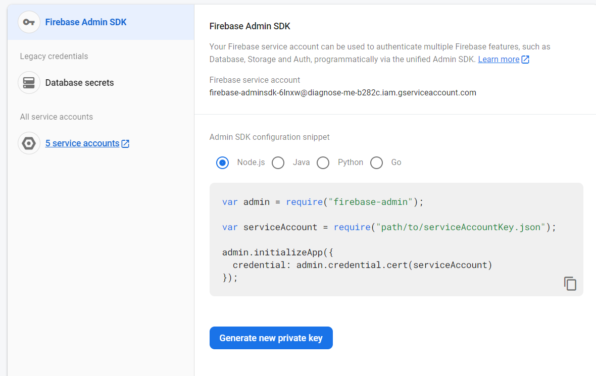

- [Sending Firebase Cloud Messaging from Node.js to send notifications](#sending-firebase-cloud-messaging-from-nodejs-to-send-notifications)
- [Adding \& Booking Appointments service](#adding--booking-appointments-service)
- [To Do](#to-do)
- [Questions](#questions)
- [Notes](#notes)

# Sending Firebase Cloud Messaging from Node.js to send notifications

1. install firebase admin SDK `npm install firebase-admin --save` <a href="https://www.techotopia.com/index.php/Sending_Firebase_Cloud_Messages_from_a_Node.js_Server#:~:text=Before%20any%20Firebase%20cloud%20messages,from%20within%20the%20Firebase%20console.">link</a>
2. Generating the Service Credentials for your account from firebase
3. save the json file you get in your app but keep it safe by adding it to .gitignore file
4. come to your server and initialize the admin SDK by copying the Admin SDK configuration snippet provided by firebase
   <details>
      <summary>example img</summary>
      
   </details>
5. start writing the notification payload and send it to a specific device token which you need to recive the notificatoin
6. Structure of the payload of notification
   1. Notification Messages - Consist of a title and a message body and trigger the notification system on arrival at the device. In other words, an icon will appear in the status bar and an entry will appear in the notification shade. Such notifications should be used when sending an informational message that you want the user to see.
   2. Data Messages - Contain data in the form of key/value pairs and are delivered directly to the app without triggering the notification system. Data messages are used when sending data silently to the app.
   3. Combined Messages – Contain a payload comprising both notification and data. The notification is shown to the user and the data is delivered to the app.
   4. Options - containe additional option such as `dryRun` – When set to true the message is not actually sent. Useful for testing purposes during development.

# Adding & Booking Appointments service

1. only doctors can add appointments
2. the date is unique identifier for each Available date record

# To Do

1. tell mohammed to parse the date to iso because it is different in DB
2. we want to clear all relevant data when removing a user

# Questions

1. can i change document root in normal queries not only aggregation pipeline?

# Notes

2. don't create schema structure that has embeded documents if these documents were complex(contains also arrays or complex objects) and you will update them with frequently with complex queries
3. `$elemMatch` operator is particularly useful when you have multiple conditions that need to be satisfied on the same array element. It allows you to perform complex queries on arrays in MongoDB.

   ```
   db.users.find({
      orders: {
         $elemMatch: {
            product: "B",
            quantity: { $gt: 10 }
         }
      }
   })

   ```

4. if the query was simple and the array wasn't an object you can use instead of `$elemMatch` the `$in` operator to match element or multiple elements:

   ```
   db.users.find({ hobbies: { $in: ["reading", "cooking"] } })
   ```

5. also notive that in the schema sturcture this is array of dates not array of objects:
   ```
   times: [
      {
        type: Date,
      },
    ]
   ```
6. ```
     enum: {
       values: ['waiting', 'approved', 'canceled'],
       message: '🙃🙃{VALUE} is not a vaild status 😫😕',
     },
   ```
7. Projection

   ```
   {
      _id: ObjectId("60e8fe8a272d5d1b4cd6f591"),
      name: "John Doe",
      orders: [
         { _id: ObjectId("60e8fe8a272d5d1b4cd6f592"), product: "A", quantity: 5 },
         { _id: ObjectId("60e8fe8a272d5d1b4cd6f593"), product: "B", quantity: 15 },
         { _id: ObjectId("60e8fe8a272d5d1b4cd6f594"), product: "C", quantity: 8 }
      ]
   }
   ```

   To retrieve the specific order with ID 60e8fe8a272d5d1b4cd6f593 from the orders array within the document with ID 60e8fe8a272d5d1b4cd6f591, you can use the following query:(you can use element match or `orders._id`)

   ```
   db.users.find(
      {
         _id: ObjectId("60e8fe8a272d5d1b4cd6f591"),
         orders: {
            $elemMatch: {
               _id: ObjectId("60e8fe8a272d5d1b4cd6f593")
            }
         }
      },
      {
      "orders.$": 1
      }
   )
   ```

   ```
      const timeSelected = await AvailableTimes.findOne({ _id: day, doctorId, 'times._id': timeId }, { 'times.$': 1 });
   ```
